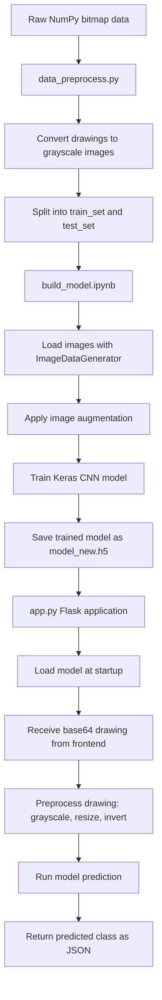

# Moodle

Moodle is a Python-based sketch recognition project that trains a convolutional neural network on hand-drawn image data and serves predictions through a Flask web application.

The workflow is built around preparing drawing data, training a Keras CNN model, saving the trained model, and exposing it through an HTTP prediction endpoint.

## Workflow

1. **Data preprocessing**

   `data_preprocess.py` converts raw NumPy bitmap data into grayscale PNG images.

   The preprocessing flow:

   - Load drawing data from a `.npy` bitmap file.
   - Select a sample range for the target class.
   - Reshape each vectorized drawing into an image grid.
   - Convert images to grayscale.
   - Save processed images into `data/train_set/` and `data/test_set/`.

2. **Model training**

   `build_model.ipynb` contains the CNN training workflow.

   The notebook:

   - Reads images from training and testing directories.
   - Resizes images to `28x28`.
   - Uses grayscale image input.
   - Applies augmentation with rotation, shifting, zooming, shearing, and flipping.
   - Trains a Keras `Sequential` convolutional neural network.
   - Saves the trained model as `model_new.h5`.

3. **Model inference**

   `app.py` loads `model_new.h5` and serves predictions through Flask.

   The inference flow:

   - Accept a base64-encoded drawing from the frontend.
   - Decode the image.
   - Convert it to grayscale.
   - Resize it to the model input size.
   - Optionally invert the drawing.
   - Run prediction using the trained Keras model.
   - Return the predicted class as JSON.

## Tech Stack

- **Python**: Main programming language.
- **Flask**: Web framework for serving the app and prediction endpoint.
- **Keras / TensorFlow**: Model definition, training, saving, and inference.
- **NumPy**: Array loading, reshaping, and prediction processing.
- **Pillow**: Image conversion, resizing, and file generation.
- **Jupyter Notebook**: Model experimentation and training workflow.
- **HDF5**: Stores the trained model in `model_new.h5`.
## Workflow Flowchart



## Methodology

This project follows a supervised image classification methodology.

The raw drawing data is first normalized into image files so it can be used by Keras image generators. The dataset is then split into training and testing folders to support validation on unseen samples.

A convolutional neural network is used because drawings contain spatial patterns. Convolution layers learn visual features, pooling layers reduce feature size, dropout helps reduce overfitting, and dense layers produce final class probabilities.

Image augmentation is used during training to make the model more robust to variation in how users draw the same object or expression.

After training, the model is saved and deployed through a Flask application. The Flask app applies the same basic preprocessing steps during inference so user-submitted drawings match the model’s expected input format.

## Repository Structure

```text
.
├── README.md
├── app.py                 # Flask inference service
├── build_model.ipynb      # CNN model training workflow
├── data_preprocess.py     # Converts bitmap arrays into image datasets
└── model_new.h5           # Saved trained Keras model
